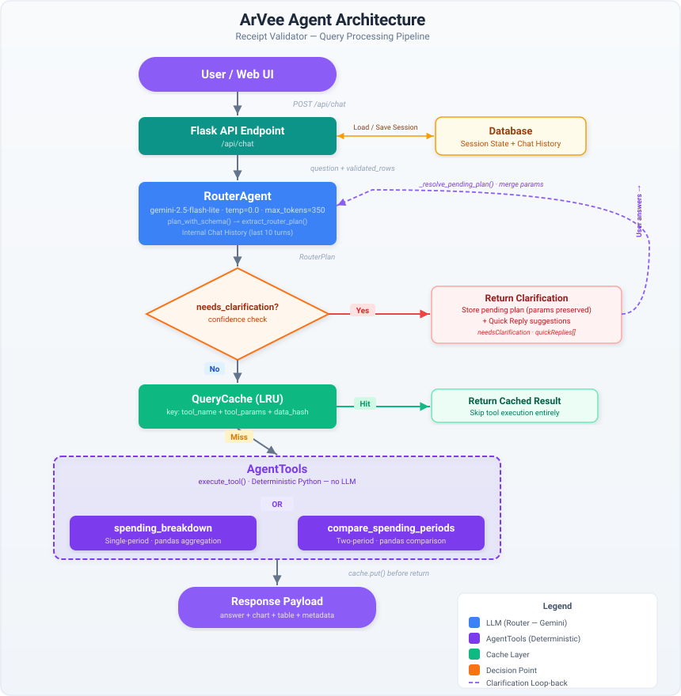

# ArVee Agent

ArVee is the conversational analytics assistant in Receipt Validator. It answers user questions over validated transaction data — providing spending totals, averages, category breakdowns, top-N summaries, period-over-period comparisons, and interactive chart visualizations.

### Agent Architecture Diagram

### Component Overview

| Component | Role | Model |
|---|---|---|
| `RouterAgent` | Classifies intent, selects tool, extracts params as structured JSON | `gemini-2.5-flash-lite` (zero temperature) |
| `AgentTools` | Executes deterministic analytics tools and returns structured outputs plus deterministic text | — |
| `LLMBase` | Shared base class for Gemini config loading, API-key resolution, and model initialization | — |

### Key Design Decisions

- **Router is non-thinking**: Uses `gemini-2.5-flash-lite` (no chain-of-thought) with `temperature=0.0` and `max_tokens=350` for fast, deterministic JSON extraction.
- **Deterministic tool execution**: All math (filtering, grouping, aggregation) runs in Python via pandas — the LLM never computes numbers.
- **Router-first execution**: RouterAgent resolves the tool and params, then directly dispatches deterministic execution through `AgentTools`.
- **Conversation context**: RouterAgent tracks the last 10 turns internally and seeds from external DB history on first call, enabling follow-up questions.
- **Multi-turn clarification**: When params are ambiguous or missing, RouterAgent stores a pending plan, returns a clarification question with quick-reply suggestions, and merges the user's answer with previously extracted params.
- **Chart payloads are data-only**: Tools return structured JSON chart descriptors (`{ type, labels, values, ... }`). The frontend renders them as inline SVG — no server-side image generation.
- **Optional synthesis hook**: Shared synthesis helpers exist in `LLMBase` for future use, but default runtime responses are deterministic.

### ArVee Agent in the UI

---

## Tools

ArVee exposes two tools that the RouterAgent selects between based on user intent.

### 1. `spending_breakdown`

Single-period aggregation over validated transactions. Filters by category (fuzzy-matched), time period, and aggregation method (`sum` or `average`). Supports top-N category ranking and optional bar or pie chart output.

### 2. `compare_spending_periods`

Compares spending between two periods (e.g. this month vs last month) with delta and percent-change computation. Supports weekly-average normalization and optional grouped-bar, bar, or pie chart output.

---

## Visualization

When the user requests a graph, the tool response includes a `chart` payload — a JSON descriptor that the frontend renders as inline SVG.

- **Bar / Pie** charts for single-period breakdowns via `spending_breakdown`
- **Grouped Bar** charts for period comparisons via `compare_spending_periods`
- Charts render above the text answer, with an expand button for full-screen viewing
- X-axis labels auto-rotate when there are more than 4 categories
- Text answers are limited to a top-5 summary when a chart is present

---

## Main Functionality

### 1. Spend Aggregation

Computes total spend for all validated rows or filtered subsets (for example, category or time-period queries). When no timeframe is specified, aggregates across all available transactions.

### 2. Category Breakdown and Ranking

Returns top categories by sum or average using grouped aggregations across validated transactions.

### 3. Time-Scoped Analysis

Supports time-period queries including "this month", "last month", "N months ago", and explicit `YYYY-MM` month references. Defaults to all available transactions when no timeframe is specified.

### 4. Period Comparison

Compares two periods side-by-side with delta and percent-change calculations. Supports weekly-average normalization for fair comparison of periods with different lengths.

<table><tr>
<td></td>
<td>&nbsp;&nbsp;&nbsp;</td>
<td></td>
</tr></table>

### 5. Interactive Charts

Generates bar, pie, and grouped-bar chart visualizations rendered as inline SVG in the chat UI. Charts are expandable to full-screen for detailed inspection.

